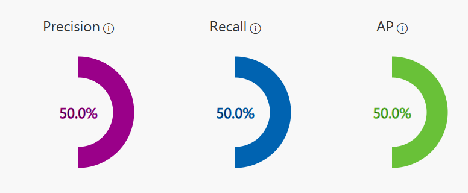

# Azure AI Custom Vision Demo

This is another no-code image classification project using **Azure AI Custom Vision**. It explores how machine learning can recognize tagged objects from curated image datasets.

## What I Did

- Created a Custom Vision project in the Azure portal
- Uploaded images across 2 tags:
  - `Magic Item`
  - `Non-Magic`
- Trained a classifier with a small dataset (5 images per tag)
- Achieved 50% accuracy on initial training (and proud of it!)

## 🗂Repo Contents

| Folder     | Description                                  |
|------------|----------------------------------------------|
| `dataset/` | Input images for training across both tags   |
| `results/` | Screenshots and metrics from training output |

## Training Metrics

Quick training was completed using the free tier (`F0`).  
The precision, recall, and probability scores are stored in `results/performance.json`.

## Training Metrics Preview  
A snapshot from the training moment, captured during a magical classification demo using Azure Custom Vision.

> Tags used: "Corals" and "Ashwinder."  
> Accuracy: 50% — a meaningful first step in model learning

> The project uses a small sample for experimentation. Accuracy will improve with larger, balanced datasets.

## Source Image Safety

All image uploads used are safe for public sharing and do not contain personal data. Tags are poetic, playful, and intended for exploratory AI testing only.

## Project Timeline

- Phase 1: Created Custom Vision project  
- Phase 2: Trained with 5 images per tag  
- Phase 3: Captured training metrics  
- Phase 4: Expand dataset, retrain, and document results

## Next Steps

- Add more images per tag
- Try multi-tag classification or object detection
- Possibly script training pipeline in Python or PowerShell

##Final Note

>Moving on to the next task, will circle back on this and create a better pipeline for Custom Vision

---

**License**: MIT  
**Created by**: [Sharmaine Erika](https://www.linkedin.com/in/your-link)
